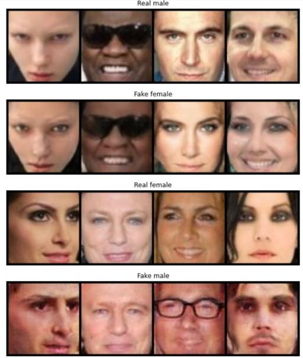
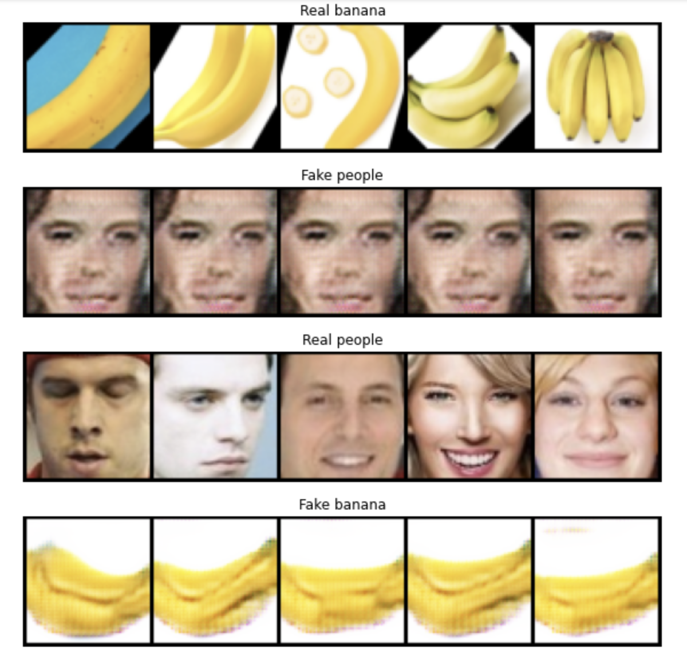
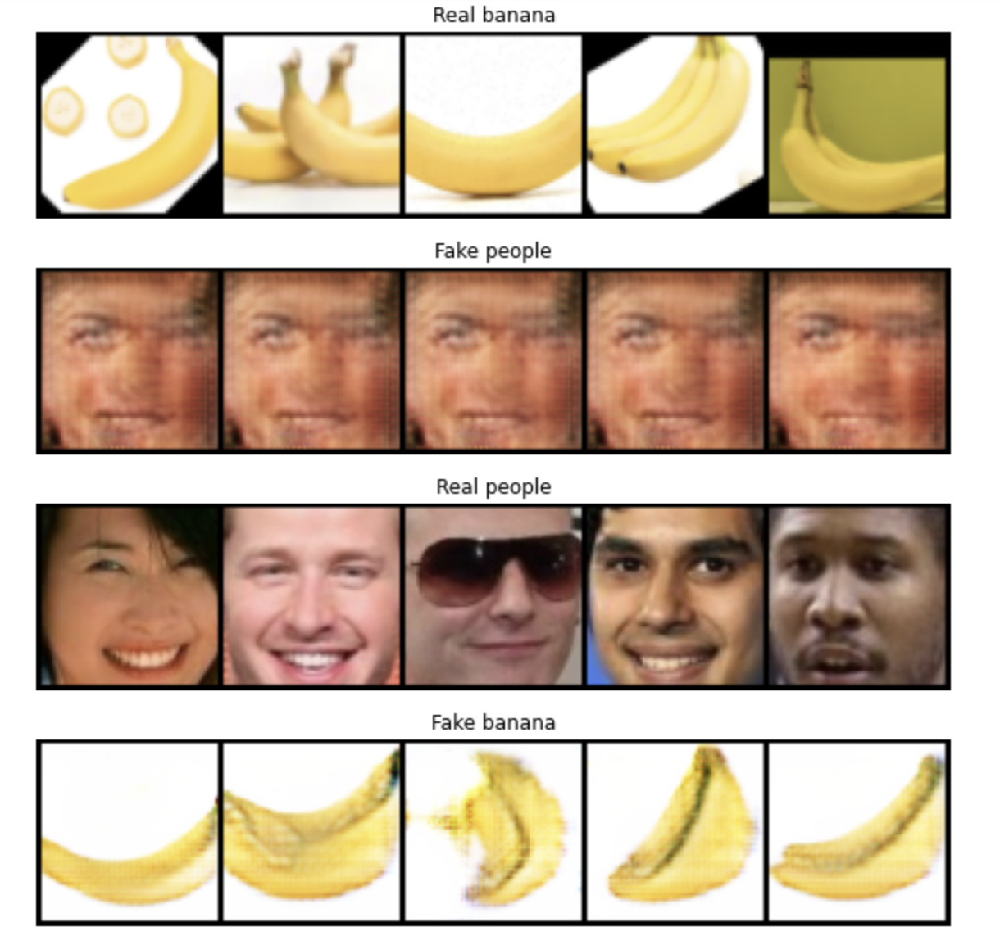

# Реализация CycleGAN на примере преобразования людей в бананы и бананов в людей
Архитектура обучения изучалась на основе [документации](https://www.tensorflow.org/tutorials/generative/cyclegan) TF, 
а так же PyTorch [реализации](https://github.com/junyanz/pytorch-CycleGAN-and-pix2pix).
После того, как модель была готова, было проведено обучение на доменах мужское/женское лицо,
как на предположительно наиболее простых доменах (так впоследствии и оказалось). Датасет состоял из 16к изображений
каждого домена. Параметры лосса генератора установлены (1,1,1). После 10 эпох сеть показала отличные результаты

Затем уже взялся за бананы и людей. Датасеты содержат по 1300 изображений каждого домена. 
После первых 50 эпох стало понятно, что с параметрами лосса (1,1,1) сеть коллапсирует.

После изменения параметров лосса на (1,1,3) генератор бананов перестал выдавать одинаковые картинки,
но вот с генератором людей проблема осталась

*На момент версии v0.1 генератор людей все еще коллапсирует*
